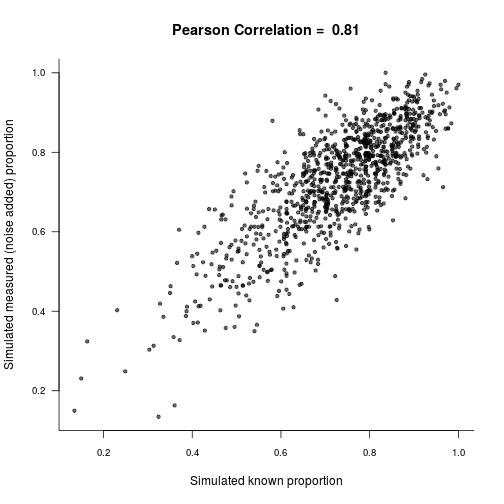
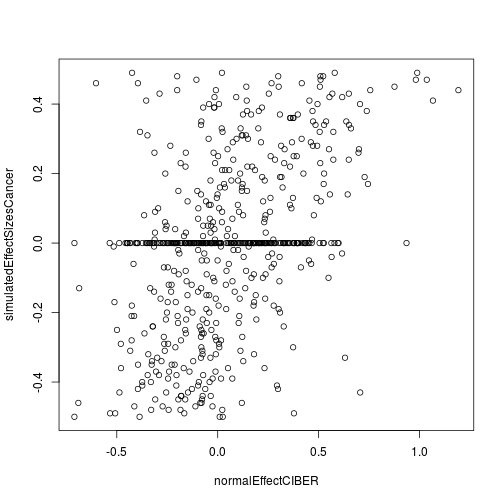
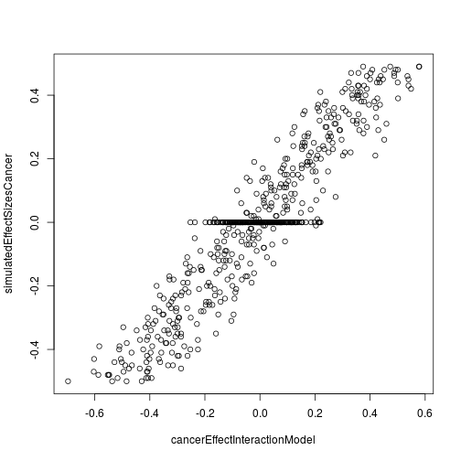
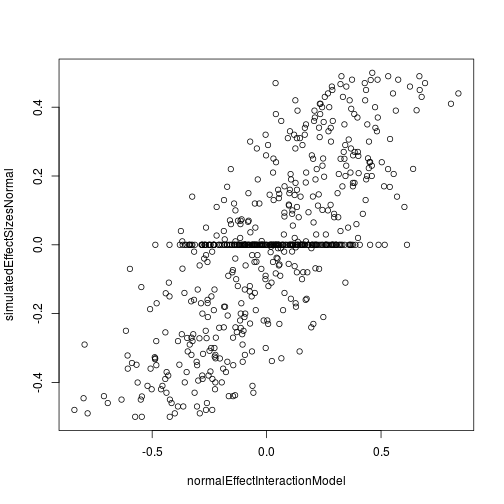
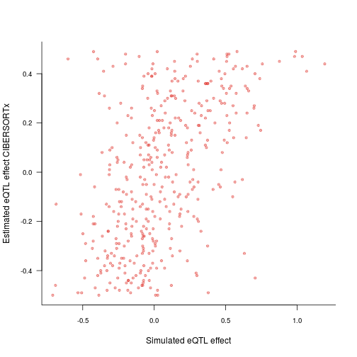
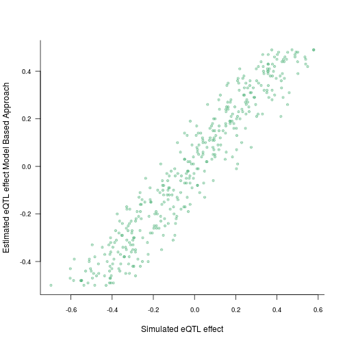

Comparison of CIBERSORTx to a model based approach for cell-type specific eQTL finding.
Load the CIBERSORTx example files, signature matrix and mixture expression data. The authors have not provided a software package for generating these estimates, thus, users much upload their data to a website (https://cibersortx.stanford.edu/), where these files are returned.


```r
#setwd("/home/user/Dropbox/predixcanProj/bayesianEqtls/scripts/CibersortX_comparison/")
cSortSigMatEg <- read.delim("/home/user/Dropbox/predixcanProj/bayesianEqtls/scripts/CibersortX_comparison/sigmatrix_Fig4a.txt")
cSortBulkMatEg <- read.delim("/home/user/Dropbox/predixcanProj/bayesianEqtls/scripts/CibersortX_comparison/Fig4a-arrays-SimulatedMixtures.MAS5.txt")
write.table(as.character(cSortSigMatEg[1:600,1]), quote=F, row.names=F, col.names=F, file="/home/user/Dropbox/predixcanProj/bayesianEqtls/scripts/CibersortX_comparison/geneSubsetFile.txt") # cibersort requires this file, which is not supplied. Its a list of genes to test.
```

Create Simulated Data: and coerse into CIBERSORTx format
Create actual simulated Expression datasets of 1,000 samples and 600 genes....


```r
'%&%' <- function(x, y)paste(x,y, sep= "") # operator to concatenate strings:
cancerExpressionSimMat <- numeric(600*1000)
normalExpressionSimMat <- numeric(600*1000)
bulkExpressionSimMat <- numeric(600*1000)
normalEffectsIndependentOfCancer <- numeric(600*1000)
dim(cancerExpressionSimMat) <- c(600, 1000)
dim(normalExpressionSimMat) <- c(600, 1000)
dim(bulkExpressionSimMat) <- c(600, 1000)
dim(normalEffectsIndependentOfCancer) <- c(600, 1000)
numSamps <- 250
set.seed(12345)
theRootDir <- "/home/user/Dropbox/predixcanProj/data/tcgaDeconvolution/"
```

Load the CPE tumor purity estimates for breast cancer. i.e. I will use these as the simulated cell proportions, learned from TCGA data.


```r
nComsProps <- read.csv(paste(theRootDir, "ncomms9971-s2.csv", sep=""), as.is=T)
nComsProps_brca <- nComsProps[nComsProps[,2] == "BRCA" & substring(nComsProps[,1], 14, 16) == "01A", "CPE"] # exctract 01A (primary site) breast cancer samples.
nComsProps_brca_noNa <- nComsProps_brca[!is.na(nComsProps_brca)]
theProp <- sample(nComsProps_brca_noNa, 1000) # select 1000 samples at random (without replacement).
propInv <- (1-theProp)
```

Create 100 genes with a mixture of *different* eQTL in both Cancer and normal component. Increment effect sizes from -1 to +1.


```r
simulatedEffectSizesCancer <- seq(-.5, 0.49, .01) # Create 100 simulated effect sizes....
simulatedEffectSizesNormal <- sample(simulatedEffectSizesCancer) # randomeize the above
for(i in 1:100)
{
  # NOTE: rnorm() will add noise and mean of 0 and sd of 1, because the real data were standardized to a mean of 0 and sd of 1.
  cancerExpressionSimMat[i,] <- c(rep(1, numSamps) + rnorm(numSamps), rep(1 + simulatedEffectSizesCancer[i], (numSamps*2)) + rnorm(numSamps), rep(1 + (simulatedEffectSizesCancer[i]*2), numSamps) + rnorm(numSamps))
  normalExpressionSimMat[i,] <- c(rep(1, numSamps) + rnorm(numSamps), rep(1 + simulatedEffectSizesNormal[i], (numSamps*2)) + rnorm(numSamps), rep(1 + (simulatedEffectSizesNormal[i]*2), numSamps) + rnorm(numSamps))
  bulkExpressionSimMat[i, ] <- (cancerExpressionSimMat[i,] * theProp) + (normalExpressionSimMat[i,] * propInv) # Combine the above to create a bulk expression data, assuming gene expression is additive based on the proportions.
}
```

Create 100 genes with an eQTL in cancer only


```r
simulatedEffectSizesCancer[101:200] <- seq(-.5, 0.49, .01)
simulatedEffectSizesNormal[101:200] <- rep(0, 100) 
for(i in 101:200)
{
  cancerExpressionSimMat[i,] <- c(rep(1, numSamps) + rnorm(numSamps), rep(1 + simulatedEffectSizesCancer[i], (numSamps*2)) + rnorm(numSamps), rep(1 + (simulatedEffectSizesCancer[i]*2), numSamps) + rnorm(numSamps))
  normalExpressionSimMat[i,] <- c(rep(1, numSamps) + rnorm(numSamps), rep(1 + simulatedEffectSizesNormal[i], (numSamps*2)) + rnorm(numSamps), rep(1 + (simulatedEffectSizesNormal[i]*2), numSamps) + rnorm(numSamps))
  bulkExpressionSimMat[i, ] <- (cancerExpressionSimMat[i,] * theProp) + (normalExpressionSimMat[i,] * propInv) # Combine the above to create a bulk expression data, assuming gene expression is additive based on the proportions.
  normalEffectsIndependentOfCancer[i,] <- residuals(lm(normalExpressionSimMat[i,]~cancerExpressionSimMat[i,])) # This will be used later, to show the interaction model values arne't correlated with normal.
}
```

Create 100 genes with an eQTL in normal only


```r
simulatedEffectSizesCancer[201:300] <- rep(0, 100) 
simulatedEffectSizesNormal[201:300] <- seq(-.5, 0.49, .01) 
for(i in 201:300)
{
  cancerExpressionSimMat[i,] <- c(rep(1, numSamps) + rnorm(numSamps), rep(1 + simulatedEffectSizesCancer[i], (numSamps*2)) + rnorm(numSamps), rep(1 + (simulatedEffectSizesCancer[i]*2), numSamps) + rnorm(numSamps))
  normalExpressionSimMat[i,] <- c(rep(1, numSamps) + rnorm(numSamps), rep(1 + simulatedEffectSizesNormal[i], (numSamps*2)) + rnorm(numSamps), rep(1 + (simulatedEffectSizesNormal[i]*2), numSamps) + rnorm(numSamps))
  bulkExpressionSimMat[i, ] <- (cancerExpressionSimMat[i,] * theProp) + (normalExpressionSimMat[i,] * propInv) # Combine the above to create a bulk expression data, assuming gene expression is additive based on the proportions.
}
```

Create 100 genes with an eQTL in neither


```r
simulatedEffectSizesCancer[301:400] <- rep(0, 100) 
simulatedEffectSizesNormal[301:400] <- rep(0, 100) 
for(i in 301:400)
{
  cancerExpressionSimMat[i,] <- c(rep(1, numSamps) + rnorm(numSamps), rep(1 + simulatedEffectSizesCancer[i], (numSamps*2)) + rnorm(numSamps), rep(1 + (simulatedEffectSizesCancer[i]*2), numSamps) + rnorm(numSamps))
  normalExpressionSimMat[i,] <- c(rep(1, numSamps) + rnorm(numSamps), rep(1 + simulatedEffectSizesNormal[i], (numSamps*2)) + rnorm(numSamps), rep(1 + (simulatedEffectSizesNormal[i]*2), numSamps) + rnorm(numSamps))
  bulkExpressionSimMat[i, ] <- (cancerExpressionSimMat[i,] * theProp) + (normalExpressionSimMat[i,] * propInv) # Combine the above to create a bulk expression data, assuming gene expression is additive based on the proportions.
}
```

Create 100 genes with the SAME eQTL in Cancer and normal. 


```r
simulatedEffectSizesCancer[401:500] <- seq(-.5, 0.49, .01)
simulatedEffectSizesNormal[401:500] <- seq(-.5, 0.49, .01)
for(i in 401:500)
{
  cancerExpressionSimMat[i,] <- c(rep(1, numSamps) + rnorm(numSamps), rep(1 + simulatedEffectSizesCancer[i], (numSamps*2)) + rnorm(numSamps), rep(1 + (simulatedEffectSizesCancer[i]*2), numSamps) + rnorm(numSamps))
  normalExpressionSimMat[i,] <- c(rep(1, numSamps) + rnorm(numSamps), rep(1 + simulatedEffectSizesNormal[i], (numSamps*2)) + rnorm(numSamps), rep(1 + (simulatedEffectSizesNormal[i]*2), numSamps) + rnorm(numSamps))
  bulkExpressionSimMat[i, ] <- (cancerExpressionSimMat[i,] * theProp) + (normalExpressionSimMat[i,] * propInv) # Combine the above to create a bulk expression data, assuming gene expression is additive based on the proportions.
}
```

Create 100 genes with SIMILAR eQTL in Cancer and Normal. I.e. add some noise to the "cancer" eQTL effect size to create a "normal" effect size.


```r
simulatedEffectSizesCancer[501:600] <- seq(-.5, 0.49, .01)
a <- seq(-.5, 0.49, .01) + rnorm(100, 0, .1)
aScaled <- (a / max(a)) *.5 # Scale this so the effects won't be bigger than .5, to be consitent with everything else.
simulatedEffectSizesNormal[501:600] <- aScaled
for(i in 501:600)
{
  cancerExpressionSimMat[i,] <- c(rep(1, numSamps) + rnorm(numSamps), rep(1 + simulatedEffectSizesCancer[i], (numSamps*2)) + rnorm(numSamps), rep(1 + (simulatedEffectSizesCancer[i]*2), numSamps) + rnorm(numSamps))
  normalExpressionSimMat[i,] <- c(rep(1, numSamps) + rnorm(numSamps), rep(1 + simulatedEffectSizesNormal[i], (numSamps*2)) + rnorm(numSamps), rep(1 + (simulatedEffectSizesNormal[i]*2), numSamps) + rnorm(numSamps))
  bulkExpressionSimMat[i, ] <- (cancerExpressionSimMat[i,] * theProp) + (normalExpressionSimMat[i,] * propInv) # Combine the above to create a bulk expression data, assuming gene expression is additive based on the proportions.
}
```

Write out simulated bulk data for CIBERSORTx (https://cibersortx.stanford.edu/)


```r
# First tack on 20 genes we'll use as "signatures", for esimating the cell type proportions.
normalGenesExpr <- (1:20) / 5
cancerGenesExpr <- (20:1) / 5
sigMat <- cbind(normalGenesExpr, cancerGenesExpr)
theSigGenesExprMat <- numeric(20*1000)
dim(theSigGenesExprMat) <- c(20, 1000)
for(i in 1:20) # loop by gene
{
    for(j in 1:1000) # loop by subject
    {
        theSigGenesExprMat[i,j] <- (normalGenesExpr[i]*theProp[j]) + (cancerGenesExpr[i]*(1-theProp[j]))
    }
}
```

Add noise


```r
normalGenesExpr <- normalGenesExpr + rnorm(20, 0, .15)
cancerGenesExpr <- cancerGenesExpr + rnorm(20, 0, .15)
```

Join the two matrices together, 1:600 being the genes with eQTLs, 601:620 being the signature genes for estimating proportions....?


```r
cyberMatSimFin <- rbind(bulkExpressionSimMat, theSigGenesExprMat)
cyberMatSimFin <- cbind(as.character(cSortBulkMatEg[1:620, 1]), cyberMatSimFin) # include the gene names
cyberMatSimFin <- rbind(c("GeneSymbol", paste("bulk", 1:1000, sep="")), cyberMatSimFin)
sigMatrixCib <- cbind(normalGenesExpr, cancerGenesExpr)
sigMatrixCib <- cbind(as.character(cSortBulkMatEg[601:620, 1]), sigMatrixCib)
sigMatrixCib <- rbind(c("GeneSymbol", "NormalExpr", "CancerExpr"), sigMatrixCib)
```

Write out the signature matrix, bulk mattrix and gene list file for CIBERSORT (these files have been created, uncomment to run again)


```r
#write.table(sigMatrixCib, quote=F, row.names=F, col.names=F, sep="\t", file="sigMatFile_eQTL_data.txt")
#write.table(cyberMatSimFin, quote=F, row.names=F, col.names=F, sep="\t", file="bulkExprMatFile_eQTL_data.txt")
#write.table(as.character(cyberMatSimFin[2:621,1]), quote=F, row.names=F, col.names=F, sep="\t", file="geneSubsetFile_eQTL_data.txt") # cibersort requires this  file with a list of gene names to "deconvolute" Its a list of genes to test.
```

Now run an analysis and see how many "cancer" and "normal" eQTLs we can recover using a model based approach


```r
genotype <- c(rep(0, numSamps), rep(1, (numSamps*2)), rep(2, numSamps)) # genotype is always the same
cancerEffectInteractionModel <- numeric()
normalEffectInteractionModel <- numeric()
bulkEffectConventionalModel <- numeric()
pValuesBulkTumor <- numeric()
pValuesCancerInteractionModel <- numeric()
interactionTermPvalue <- numeric()
pValuesCancerInteractionModel_randomCpe <- numeric()
```

Create vector of the estimated proportions, but add measurement noise, to reflect the fact that these will not be estimated exactly in the real data.


```r
thePropNoisier <- theProp + rnorm(length(theProp), 0,0.1)
```

Quantile normalize the noise added proportions so they are on an identical distribution to the original proportions (but have noise added, i.e. they will be reordered to some extent).


```r
thePropSort <- sort(theProp)
thePropNoise <- thePropSort[rank(thePropNoisier)]
propInvNoise <- (1-thePropNoise)
```

Plot this correlation


```r
thisCor <- cor(thePropNoise, theProp) # this correlation is reasonable based on the correlations achieved by different genomics methods.
plot(theProp, thePropNoise, main=paste("Pearson Correlation = ", format(round(thisCor, 2), nsmall = 2)), las=1, cex.axis=.8, pch=20, col="#00000099", xlab="Simulated known proportion", ylab="Simulated measured (noise added) proportion", bty="l")
```



Recover the eQTLs using the different types of models (i.e. interaction (cancer) and conventional (bulk tumor)


```r
for(i in 1:nrow(bulkExpressionSimMat))
{
  cancerEffectInteractionModel[i] <- coef(summary(lm(bulkExpressionSimMat[i,]~genotype*propInvNoise)))[2, 1] # We use this inverse, as we want the main efffect "genotype" to correspond to 0% normal cells (which is 100% cancer.).
  normalEffectInteractionModel[i] <- coef(summary(lm(bulkExpressionSimMat[i,]~genotype*thePropNoise)))[2, 1]
  bulkEffectConventionalModel[i] <- coef(summary(lm(bulkExpressionSimMat[i,]~genotype)))[2, 1]
  pValuesBulkTumor[i] <- coef(summary(lm(bulkExpressionSimMat[i,]~genotype)))[2, 4]
  pValuesCancerInteractionModel[i] <- coef(summary(lm(bulkExpressionSimMat[i,]~genotype*propInvNoise)))[2, 4]
  pValuesCancerInteractionModel_randomCpe[i] <- coef(summary(lm(bulkExpressionSimMat[i,]~genotype*sample(propInvNoise))))[2, 4]
  interactionTermPvalue[i] <- coef(summary(lm(bulkExpressionSimMat[i,]~genotype*propInvNoise)))[4, 4]
}
fdrCancerInteraction <- p.adjust(pValuesCancerInteractionModel, method="BH")
fdrBulkTumor <- p.adjust(pValuesBulkTumor, method="BH")
fdrSigInCancerInteraction <- fdrCancerInteraction < 0.05
fdrSigInBulkTumor <- fdrBulkTumor < 0.05
```

Load the "new" data outputted by CIBERSORTx (https://cibersortx.stanford.edu/).


```r
cancerExpressionProfileOut <- read.delim("/home/user/CibersortTest/CIBERSORTx_Job6_output/CIBERSORTxHiRes_Job6_CancerExpr_Window8.txt")
normalExpressionProfileOut <- read.delim("/home/user/CibersortTest/CIBERSORTx_Job6_output/CIBERSORTxHiRes_Job6_NormalExpr_Window8.txt")
rownames(cancerExpressionProfileOut) <- cancerExpressionProfileOut[,1]
cancerExpressionProfileOut[,1] <- NULL
rownames(normalExpressionProfileOut) <- normalExpressionProfileOut[,1]
normalExpressionProfileOut[,1] <- NULL
cancerExpressionProfileOut <- data.matrix(cancerExpressionProfileOut)
normalExpressionProfileOut <- data.matrix(normalExpressionProfileOut)
cancerEffectCIBER <- numeric()
normalEffectCIBER <- numeric()
pValuesNormalCIBER <- numeric()
pValuesCancerCIBER <- numeric()
```

Recover the eQTLs using the different types of models (i.e. interaction (cancer) and conventional (bulk tumor)


```r
options(warn=-1)
for(i in 1:nrow(bulkExpressionSimMat))
{
  cancerEffectCIBER[i] <- coef(summary(lm(cancerExpressionProfileOut[i,]~genotype*propInvNoise)))[2, 1] # We use this inverse, as we want the main efffect "genotype" to correspond to 0% normal cells (which is 100% cancer.).
  normalEffectCIBER[i] <- coef(summary(lm(normalExpressionProfileOut[i,]~genotype*thePropNoise)))[2, 1]
  
  pValuesCancerCIBER[i] <- coef(summary(lm(cancerExpressionProfileOut[i,]~genotype)))[2, 4]
  pValuesNormalCIBER[i] <- coef(summary(lm(normalExpressionProfileOut[i,]~genotype*propInvNoise)))[2, 4]
}
fdrCancerInteraction <- p.adjust(pValuesCancerInteractionModel, method="BH")
fdrBulkTumor <- p.adjust(pValuesBulkTumor, method="BH")
fdrSigInCancerInteraction <- fdrCancerInteraction < 0.05
fdrSigInBulkTumor <- fdrBulkTumor < 0.05
sum(p.adjust(pValuesCancerInteractionModel_randomCpe, method="BH") < 0.05) # we get the fewest associations with a randomly arranged tumor purity estimate (same as what happens TCGA breast cancer).
```

```
## [1] 240
```

```r
plot(normalEffectCIBER, simulatedEffectSizesCancer)
```



```r
cor.test(normalEffectCIBER, simulatedEffectSizesCancer)
```

```
## 
## 	Pearson's product-moment correlation
## 
## data:  normalEffectCIBER and simulatedEffectSizesCancer
## t = 11.851, df = 598, p-value < 2.2e-16
## alternative hypothesis: true correlation is not equal to 0
## 95 percent confidence interval:
##  0.3689354 0.4987360
## sample estimates:
##       cor 
## 0.4361012
```

```r
cor.test(cancerEffectCIBER, simulatedEffectSizesNormal)
```

```
## 
## 	Pearson's product-moment correlation
## 
## data:  cancerEffectCIBER and simulatedEffectSizesNormal
## t = -0.55668, df = 598, p-value = 0.578
## alternative hypothesis: true correlation is not equal to 0
## 95 percent confidence interval:
##  -0.10261593  0.05739043
## sample estimates:
##         cor 
## -0.02275849
```

```r
cor.test(cancerEffectInteractionModel, simulatedEffectSizesCancer) # pearson correlation 0.9346703 
```

```
## 
## 	Pearson's product-moment correlation
## 
## data:  cancerEffectInteractionModel and simulatedEffectSizesCancer
## t = 62.074, df = 598, p-value < 2.2e-16
## alternative hypothesis: true correlation is not equal to 0
## 95 percent confidence interval:
##  0.9187851 0.9404127
## sample estimates:
##       cor 
## 0.9304042
```

```r
plot(cancerEffectInteractionModel, simulatedEffectSizesCancer)
```



```r
cor.test(normalEffectInteractionModel, simulatedEffectSizesNormal)
```

```
## 
## 	Pearson's product-moment correlation
## 
## data:  normalEffectInteractionModel and simulatedEffectSizesNormal
## t = 25.468, df = 598, p-value < 2.2e-16
## alternative hypothesis: true correlation is not equal to 0
## 95 percent confidence interval:
##  0.6805761 0.7576259
## sample estimates:
##       cor 
## 0.7213254
```

```r
plot(normalEffectInteractionModel, simulatedEffectSizesNormal)
```



```r
cor.test(bulkEffectConventionalModel, normalEffectCIBER)
```

```
## 
## 	Pearson's product-moment correlation
## 
## data:  bulkEffectConventionalModel and normalEffectCIBER
## t = 16.221, df = 598, p-value < 2.2e-16
## alternative hypothesis: true correlation is not equal to 0
## 95 percent confidence interval:
##  0.4946197 0.6060091
## sample estimates:
##       cor 
## 0.5527787
```

Final plots


```r
plot(normalEffectCIBER[simulatedEffectSizesCancer != 0], simulatedEffectSizesCancer[simulatedEffectSizesCancer != 0], xlab="Simulated eQTL effect", ylab="Estimated eQTL effect CIBERSORTx", pch=20, col="#de2d2666", las=1, cex.axis=.8, bty="l") 
```



```r
plot(cancerEffectInteractionModel[simulatedEffectSizesCancer != 0], simulatedEffectSizesCancer[simulatedEffectSizesCancer != 0], xlab="Simulated eQTL effect", ylab="Estimated eQTL effect Model Based Approach", pch=20, col="#2ca25f55", las=1, cex.axis=.8, bty="l") 
```



