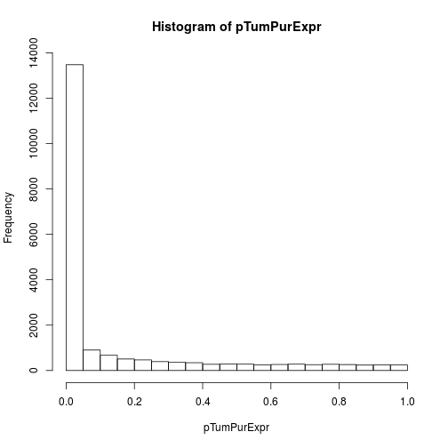

A script for comparing differential expression between HER2+ and HER2- breast cancers and comparing the results to those observed when comparing HER2+ and HER2- samples in GDSC.
Load libraries


```r
library("GenomicRanges")
library("ggplot2")
library("TxDb.Hsapiens.UCSC.hg19.knownGene")
library("org.Hs.eg.db")
library("GenomicFeatures")
```

Set the root directory.


```r
theRootDir <- "/media/user/My Passport/UofC_backup/bionimbus/data_scratch/finalData/"
```

Load the TCGA breast cancer expression data.


```r
brcaDataLoc <- paste(theRootDir, "dataIn/rnaSeq/gdac.broadinstitute.org_BRCA.Merge_rnaseqv2__illuminahiseq_rnaseqv2__unc_edu__Level_3__RSEM_genes__data.Level_3.2015082100.0.0/BRCA.rnaseqv2__illuminahiseq_rnaseqv2__unc_edu__Level_3__RSEM_genes__data.data.txt", sep="")
tpmDatMat_bc <- read.delim(brcaDataLoc, as.is=T)
tpmDatMat_bc_tpm <- apply(tpmDatMat_bc[-1,which(tpmDatMat_bc[1,] == "scaled_estimate")], 2, as.numeric)
tpmDatMat_bc_tpm <- tpmDatMat_bc[-1,which(tpmDatMat_bc[1,] == "scaled_estimate")]
tpmDatMat_bc_tpm <- apply(tpmDatMat_bc_tpm, 2, as.numeric)
geneNames <- do.call(cbind, strsplit(tpmDatMat_bc[, "Hybridization.REF"], "|", fixed=TRUE))[1,][-1]
rownames(tpmDatMat_bc_tpm) <- geneNames
colnames(tpmDatMat_bc_tpm) <- substr(colnames(tpmDatMat_bc_tpm), 1, 28)
tpmDatMat_bc_tpm_logged <- log((tpmDatMat_bc_tpm*1000000)+1)
tpmDatMat_bc_tpm_logged_tumor <- tpmDatMat_bc_tpm_logged[, do.call(rbind, strsplit(colnames(tpmDatMat_bc_tpm_logged), ".", fixed=T))[,4] == "01A"]
colnames(tpmDatMat_bc_tpm_logged_tumor) <- substring(colnames(tpmDatMat_bc_tpm_logged_tumor), 1, 12)
colnames(tpmDatMat_bc_tpm_logged_tumor) <- gsub(".", "-", colnames(tpmDatMat_bc_tpm_logged_tumor),  fixed=T)
```

Load the matched clinical data for BRCA. This file contains the HER2 status, as measured by immunohistochemistry.


```r
clinicalDataLocation <- paste(theRootDir, "dataIn/clinical/nationwidechildrens.org_clinical_patient_brca.txt", sep="")
clinDataBrca <- read.delim(clinicalDataLocation, as.is=T)
her2status <- clinDataBrca[, "her2_status_by_ihc"]
names(her2status) <- clinDataBrca[, "bcr_patient_barcode"]
```

Load the tumor purity estimates.


```r
nComsProps <- read.csv("/media/user/My Passport/UofC_backup/bionimbus/data_scratch/prediXcanProj/ncomms9971-s2.csv", as.is=T)
rownames(nComsProps) <- nComsProps[,1]
nComsProps_brca <- nComsProps[nComsProps[,2] == "BRCA" & substring(nComsProps[,1], 14, 16) == "01A", "CPE"] # exctract 01A (primary site) breast cancer samples.
names(nComsProps_brca) <- nComsProps[nComsProps[,2] == "BRCA" & substring(nComsProps[,1], 14, 16) == "01A", 1]
nComsProps_brca_noNa <- nComsProps_brca[!is.na(nComsProps_brca)]
names(nComsProps_brca_noNa) <- substring(names(nComsProps_brca_noNa), 1, 12)
samplesInAllThree <- intersect(intersect(colnames(tpmDatMat_bc_tpm_logged_tumor), names(her2status)), names(nComsProps_brca_noNa))
```

Test association of gene expression and purity as a sanity check (we expect lots of associations - this looks as expected).


```r
options(warn=-1)
pTumPurExpr <- numeric()
for(i in 1:nrow(tpmDatMat_bc_tpm_logged_tumor))
{
    pTumPurExpr[i] <- cor.test(tpmDatMat_bc_tpm_logged_tumor[i,samplesInAllThree], nComsProps_brca_noNa[samplesInAllThree])$p.value
}
hist(pTumPurExpr)
```



Define her2 + to her2- TCGA patient samples.


```r
her2Neg <- intersect(names(her2status[her2status == "Negative"]), samplesInAllThree)
her2Pos <- intersect(names(her2status[her2status == "Positive"]), samplesInAllThree)
```

Perform a simple differential expression analysis 


```r
exprData <- tpmDatMat_bc_tpm_logged_tumor[, c(her2Neg, her2Pos)]
caseControlStatus <- c(rep(0, length(her2Neg)), rep(1, length(her2Pos)))
propsFin <- 1- nComsProps_brca_noNa[c(her2Neg, her2Pos)]
pValsNaiveTcga <- numeric()
pValsIntTcga <- numeric()
betaInt <- numeric()
betaNaive <- numeric()
for(i in 1:nrow(exprData))
{
    pValsNaiveTcga[i] <- coef(summary(lm(exprData[i,]~caseControlStatus)))[2,4] # Bulk tumor analysis.
    pValsIntTcga[i] <- coef(summary(lm(exprData[i,]~caseControlStatus*propsFin)))[2,4] # Cancer specific analysis.
    betaInt[i]  <- coef(summary(lm(exprData[i,]~caseControlStatus*propsFin)))[2,1]
    betaNaive[i] <- coef(summary(lm(exprData[i,]~caseControlStatus)))[2,1]
}
names(pValsIntTcga) <- rownames(exprData)
names(pValsNaiveTcga) <- rownames(exprData)
names(betaInt) <- rownames(exprData)
names(betaNaive) <- rownames(exprData)
fdrNaiveTcga <- p.adjust(pValsNaiveTcga, method="BH")
fdrIntTcga <- p.adjust(pValsIntTcga, method="BH")
sigInt <- names(sort(fdrIntTcga[which(fdrIntTcga < 0.05)]))
sigNaive <- names(sort(fdrNaiveTcga[which(fdrNaiveTcga < 0.05)]))
```

Now investigate the association between ERBB2 amplification and lapatinib sensitivty in the GDSC cell lines.
Load the CNV data from GDSC This was acquired from cancerrxgene.org. Generated using Affymetrix SNP 6.0 data. This data was not mapped to genes by CGP, so we do that below. 


```r
allCnvs <- read.csv(paste(theRootDir, "dataIn/cell_lines_copy_number.csv", sep=""), as.is=T, header=T)
cellLines_cnv_list <- split(allCnvs, allCnvs[,1])
```

For each cell line in CGP, create a GenomicRanges object, which contains the locations and magnitutes of all Copy Number measurements. This data is GRCh37/hg19.


```r
grCnvsList <- list()
for(i in 1:length(cellLines_cnv_list))
{
  grCnvsList[[i]] <- GRanges(seqnames=Rle(paste("chr", cellLines_cnv_list[[i]][, "chr_37"], sep="")), ranges=IRanges(cellLines_cnv_list[[i]][, "startpos_37"], cellLines_cnv_list[[i]][, "endpos_37"]), segMeans=cellLines_cnv_list[[i]][, "totalCN"])
}
names(grCnvsList) <- names(cellLines_cnv_list)
```

Load the gene ranges for HG19 using.


```r
txdb <- TxDb.Hsapiens.UCSC.hg19.knownGene
geneRanges <- genes(txdb)
e2s = toTable(org.Hs.egSYMBOL)
syms <- e2s[, "symbol"]
names(syms) <- e2s[, "gene_id"]
theGeneSymsOrd <- syms[as.character(geneRanges$gene_id)]
```

We will now intersect the gene ranges with the CNV data in order to establish the copy number for each gene.


```r
numGenesQuantifid <- numeric()
theCnvQuantVecList <- list()
for(i in 1:length(grCnvsList))
{
    grCnvs <- grCnvsList[[i]]

    # Use count overlaps to find genes that unambiguously overlap a single peak. Give it an NA it it doesn't overlap a single peak. Assign it the value of the peak if it unambiguously overlaps a peak. PC.
    numOverlaps <- countOverlaps(geneRanges, grCnvs)
    numGenesQuantifid[i] <- sum(numOverlaps == 1)
    inCnv <- which(numOverlaps == 1) # take only gene unambiguously overlaping a peak, this is usually most genes.
    
    theCnvQuantVec <- rep(NA, length(geneRanges))
    olaps <- findOverlaps(geneRanges, grCnvs, type="within", ignore.strand=TRUE)
    theCnvQuantVec[queryHits(olaps)] <- grCnvs$segMeans[subjectHits(olaps)]
    theCnvQuantVecList[[i]] <- theCnvQuantVec
    names(theCnvQuantVecList[[i]]) <- theGeneSymsOrd
}
names(theCnvQuantVecList) <- names(grCnvsList)
theCnvQuantVecList_mat <- do.call(cbind, theCnvQuantVecList)
erbb2CnvVec <- theCnvQuantVecList_mat["ERBB2",]
```

We will now do some analysis testing the gene CVNs against lapatinib sensitivty here in GDSC
Load the CGP expression and phenotype data.


```r
load("/media/user/My Passport/UofC_backup/bionimbus/data_scratch/finalData/dataIn/drugAndPhenoCgp.RData") # "drugSensitivityDataCgp" "drugToCellLineDataCgp" "gdsc_brainarray_syms
load("/media/user/My Passport/UofC_backup/bionimbus/data_scratch/finalData/dataIn/cgp2016ExprRma.RData") # "cgp2016ExprRma" 
breastCancerCellLines <- drugSensitivityDataCgp[, "Cell.Line"][drugSensitivityDataCgp[, "Tissue"] == "breast"]
```

Intersect the expression and CNV data.


```r
isBrca_hasExpr_hasCnv <- intersect(intersect(breastCancerCellLines, colnames(cgp2016ExprRma)), names(erbb2CnvVec))
brcaErbb2CnvOrd <- erbb2CnvVec[isBrca_hasExpr_hasCnv]
brcaExprOrd <- cgp2016ExprRma[,isBrca_hasExpr_hasCnv]
```

Identify DE genes associated with ERBB2 amplification in GDSC. We will treat nominally significant genes with concordant directionality as a gold standard.


```r
pVals <- numeric()
betaCellLines <- numeric()
for(i in 1:nrow(brcaExprOrd))
{
    pVals[i] <- coef(summary(lm(brcaExprOrd[i,]~brcaErbb2CnvOrd)))[2,4]
    betaCellLines[i] <- coef(summary(lm(brcaExprOrd[i,]~brcaErbb2CnvOrd)))[2,1]
}
names(pVals) <- rownames(brcaExprOrd)
names(betaCellLines) <- rownames(brcaExprOrd)
nomSigCellLines <- names(pVals)[pVals < 0.05]
pAdj <- p.adjust(pVals, method="BH")
sum(pAdj < 0.05)
```

```
## [1] 136
```

```r
pAdj[pAdj < 0.05]
```

```
##        SCYL3      POLDIP2     TMEM132A     KIAA0100      CEACAM7 
## 4.278430e-02 4.528816e-02 3.201843e-02 1.305891e-02 4.278430e-02 
##      ST3GAL1       TSPAN9        XYLT2        CNTN1       FAM65C 
## 4.619246e-03 4.830994e-02 1.966430e-02 1.516990e-02 4.913673e-02 
##         EPN3       MGAT4A        SIDT1       CACNG4        TRAF4 
## 1.035577e-02 5.035535e-03 2.860765e-02 6.877314e-03 1.321713e-02 
##      RAP1GAP     TP53INP2       CRISP3        LZTR1        AP1B1 
## 4.278430e-02 1.516990e-02 8.793357e-03 7.449495e-03 4.383427e-02 
##        RBBP8        RAB3D        PSMD3        KPNB1        RASD1 
## 3.195573e-02 2.307045e-02 4.278430e-02 1.771168e-02 1.998552e-02 
##      PPP1R9B       LRRC59       CACNG1      SLC16A6     SLC9A3R1 
## 9.750560e-03 3.344043e-02 3.693599e-02 1.321713e-02 3.693599e-02 
##       SUPT6H        PHF12       GALNT7          VWF          NNT 
## 1.042630e-02 1.988250e-02 4.001437e-02 4.278430e-02 4.278430e-02 
##        ABCC5       SLC9A2         SDC1       TRIM62          KMO 
## 4.278430e-02 1.035577e-02 4.830994e-02 1.812788e-02 5.436588e-03 
##        ACYP1       EXOSC8        DUSP4      POLR3GL        CENPK 
## 6.877314e-03 1.321713e-02 4.746195e-03 3.668846e-02 2.440076e-02 
##        MCF2L       ORMDL1        TULP4       STARD3        ERAL1 
## 4.830994e-02 4.278430e-02 1.812788e-02 6.640900e-11 1.357920e-02 
##        RFXAP     CATSPERB        PSRC1      TMEM243        TACO1 
## 3.303104e-02 4.830994e-02 4.278430e-02 1.477250e-02 4.914789e-02 
##    NIPSNAP3A        TCF19       TMEM62        ERBB2         GRB7 
## 1.035577e-02 4.640630e-02 3.195573e-02 4.768528e-16 4.768528e-16 
##        MIEN1       TM4SF5        KCNH1        EPHA1       SEC16A 
## 4.768528e-16 2.492599e-03 1.516990e-02 1.068157e-03 1.035577e-02 
##      TMEM86A        CENPH        TEKT5         MSI2        GDPD1 
## 1.594680e-02 3.232420e-02 4.514493e-02 3.195573e-02 3.693599e-02 
##      SLC16A1        LRFN2         SNF8       CYB5R1          PIP 
## 1.538943e-03 4.278430e-02 4.095175e-02 4.536726e-02 1.321713e-02 
##      C21orf2       CACFD1         NEK8        PGAP3      ZNF385A 
## 4.830994e-02 4.362478e-03 4.278430e-02 7.239781e-08 3.693599e-02 
##       FAM84A       HDAC11        FYCO1      SERINC5     PPP1R14D 
## 3.195573e-02 1.042630e-02 4.278430e-02 1.035577e-02 4.483278e-02 
##      TMEM135     B4GALNT2          PHB        ACSF2         IRGQ 
## 7.837098e-03 4.830994e-02 4.483278e-02 4.278430e-02 3.217861e-02 
##      TRAPPC9         HID1        ACOX2        STIP1     TMEM150A 
## 2.838053e-02 4.539220e-02 4.278430e-02 4.536726e-02 1.035577e-02 
##         FASN       GPRC5C          FGB       ORMDL3      C2orf54 
## 4.830994e-02 4.383427e-02 4.278430e-02 5.035535e-03 3.195573e-02 
##         AGXT      FAM222B        ADCK5        ADCY5        NUDT4 
## 4.640630e-02 1.035577e-02 4.278430e-02 4.095175e-02 4.830994e-02 
##         TCAP        P2RY2       PHLDB3         ULK1       SAMD12 
## 6.877314e-03 3.313109e-02 4.278430e-02 4.434243e-02 4.278430e-02 
##      ARL6IP6       TSPYL6        GRINA      TMEM107       ZBTB42 
## 4.291106e-02 3.344043e-02 4.278430e-02 2.979055e-02 4.640630e-02 
##       CUEDC1        LIMK2        HMGN4        PDE4B    C14orf180 
## 4.830994e-02 3.286373e-02 5.829525e-04 3.628920e-02 4.619246e-03 
##       KLHL33       MAPK11     RALGAPA2       ARRDC1       ZNF655 
## 4.095175e-02 4.830994e-02 1.812788e-02 3.628920e-02 4.290553e-02 
##      SLC2A10       ZNF652        CAPN8      CCDC160      C9orf37 
## 4.830994e-02 4.362478e-03 1.347829e-02 4.278430e-02 4.830994e-02 
##    HSP90AB2P      COL28A1       SPINK8        NFAM1       MBD3L5 
## 2.424471e-02 4.536726e-02 4.619246e-03 4.640630e-02 4.278430e-02 
##      C4orf52 
## 4.830994e-02
```

```r
theDeGenes <- names(sort(pAdj[pAdj < 0.05]))
genesBothDatasets <- intersect(rownames(exprData), rownames(cgp2016ExprRma))
```

Subset to genes in both TCGA and GDSC datasets and compare the overlaps.


```r
theDeGenes_both <- theDeGenes[theDeGenes %in% genesBothDatasets]
sigInt_both <- sigInt[sigInt %in% genesBothDatasets]
sigNaive_both <- sigNaive[sigNaive %in% genesBothDatasets]
nomSigCellLines_both <- nomSigCellLines[nomSigCellLines %in% genesBothDatasets]
```

How many differentially expressed genes overlap between the two datasets (compare FDR < 0.05 from both datasets)


```r
sum(theDeGenes_both %in% sigInt_both) # cancer specific model
```

```
## [1] 17
```

```r
sum(theDeGenes_both %in% sigNaive_both) # naive bulk model
```

```
## [1] 70
```

What proportion overlap (overlap is 5 times higher for cancer-specific model)


```r
sum(theDeGenes_both %in% sigInt_both) / length(sigInt_both)
```

```
## [1] 0.07906977
```

```r
sum(theDeGenes_both %in% sigNaive_both) / length(sigNaive_both)
```

```
## [1] 0.01599634
```

Do the above analysis, treat nominally significant genes as the gold standard.


```r
sum(nomSigCellLines_both %in% sigInt_both) # cancer specific model
```

```
## [1] 56
```

```r
sum(nomSigCellLines_both %in% sigNaive_both) # naive bulk model
```

```
## [1] 796
```

What proportions overlap? Has improved from 18% to 26%


```r
sum(nomSigCellLines_both %in% sigInt_both) / length(sigInt_both)
```

```
## [1] 0.2604651
```

```r
sum(nomSigCellLines_both %in% sigNaive_both) / length(sigNaive_both)
```

```
## [1] 0.1819013
```

calculate fishers's exact test


```r
numOlapInt <- sum(sigInt_both %in% nomSigCellLines_both)
numNoOlapInt <- sum(!sigInt_both %in% nomSigCellLines_both)
numOlapNaive <- sum(sigNaive_both %in% nomSigCellLines_both)
numNoOlapNaive <- sum(!sigNaive_both %in% nomSigCellLines_both)
print(fisher.test(t(matrix(c(numOlapInt, numNoOlapInt, numOlapNaive, numNoOlapNaive), nrow=2))))
```

```
## 
## 	Fisher's Exact Test for Count Data
## 
## data:  
## p-value = 0.005229
## alternative hypothesis: true odds ratio is not equal to 1
## 95 percent confidence interval:
##  1.135245 2.183414
## sample estimates:
## odds ratio 
##   1.583839
```

Calculate the proportion of times directionality is concordant, is that improved? (ans: yes)


```r
concDirInt <- betaInt[sigInt_both] * betaCellLines[sigInt_both] # how often is directionality concordant 
concDirNaive <- betaNaive[sigNaive_both] * betaCellLines[sigNaive_both]
sum(concDirInt > 0) / length(concDirInt)
```

```
## [1] 0.7162791
```

```r
sum(concDirNaive > 0) / length(concDirNaive)
```

```
## [1] 0.6590494
```

